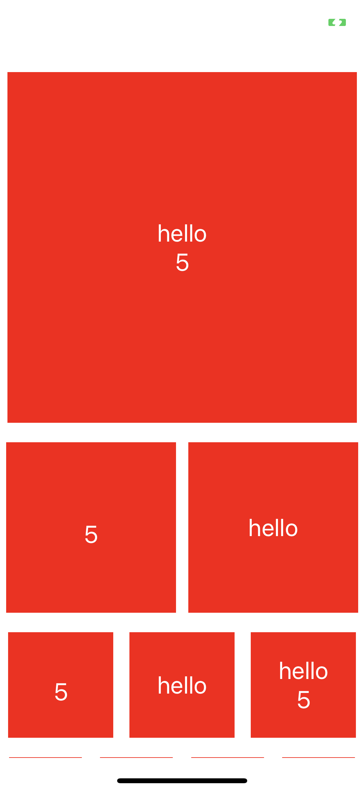

# React Native Tile View

A utility for creating tile views in React Native.


[](https://opensource.org/licenses/unlicense)

<p align="center">

</p>

## Installation

Add the dependency:

### React Native:

```js
npm i @thang2162/react-native-tile-view

or,

yarn add @thang2162/react-native-tile-view
```

## Peer Dependencies

###### IMPORTANT! You need install them.

```js
"react": ">= 16.x.x",
"react-native": ">= 0.55.x",
```

## Basic Usage

```js
import TextArea from "@thang2162/react-native-tile-view";

const tiles = [
  {tpr: 1, touchable: true, data: {text: 'hello', number: 5}},
  {tpr: 2, data: {number: 5}},
  {tpr: 2, touchable: true, data: {text: 'hello'}},
  {tpr: 3, data: {number: 5}},
  {tpr: 3, touchable: true, data: {text: 'hello'}},
  {tpr: 3, data: {text: 'hello', number: 5}},
  {tpr: 4, data: {text: 'hello'}},
  {tpr: 4, data: {number: 5}},
  {tpr: 4, data: {text: 'hello'}},
  {tpr: 4, data: {text: 'hello', number: 5}},
];

const tileContent = (data) => (
  <View>
    <Text>{data.text}</Text>
    {data.number && <Text>{data.number}</Text>}
  </View>
);

<Tiles
  tiles={tiles}
  tileContent={tileContent}
/>
```

## Configuration - Props

| Property               |  Type    |    Default     | Description                               |
| --------------------   | :----:   | :------------: | ----------------------------------------- |
| customStyle            | style    | check the code | Set your own style                        |
| showChildren           | boolean  |  true or false | Show child slot content instead of tiles  |
| tileContent - required | jsx      |                | Set the template for your tiles           |
| tiles - required       | array    |       []       | Object array containing tile data         |
| onTileTouch            | callback |                | Callback for touchable tiles              |
| refreshControl         | jsx      |                | Set a Refresh Control for pull to refresh |

## Tiles - Object Structure Details

tpr or tiles per row is required and sets the size of the tiles and can go up to 4 tiles.

touchable is optional and makes the tile in question touchable.

data is optional and where you put data you wish to be available in the tileContent

## Custom Styles - Details

To change the main container set styles under the container key in the style Object.

To change the item container set styles under the item key in the style Object.

The style object be initialized through StyleSheet.create() before being set into the customStyle prop. See the example for more details.

## Author

thang2162, netguy87@gmail.com

## License

React Native Tile View Library is available under the Unlicense. See the LICENSE file for more info.
